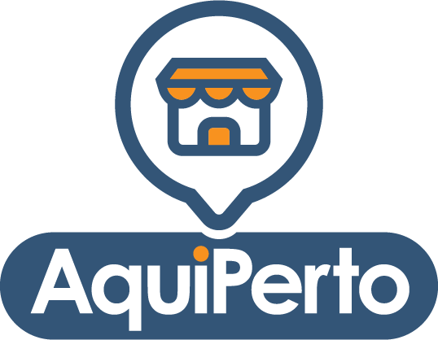

# AquiPerto
Projeto realizado para o **MEGAHACK 2020 2° Edição**, para o **DESAFIO SEBRAE**.
## Proposta
[AquiPerto](https://equipe28.azurewebsites.net/home/) é uma plataforma que simplifica a solução de seus problemas. Conectamos você à empresas e especialistas locais, não apenas para vender produtos e serviços, mas para ajudá-lo a encontrar soluções para o que precisa.

### MVP
" height="600em"/>

### Time 28 - Participantes
* Jeferson Carvalho - **UI/UX Goiânia/GO** [LinkedIN](https://www.linkedin.com/in/jeferson1f/) [Behance](https://www.behance.net/jeferson1f)
* Marcelo Cabral **Backend/Business Porto Alegre/RS** [LinkedIN](https://www.linkedin.com/in/marcelocabralghilardi/) [GitHub](https://github.com/kabrau)
* Thais Andrade **Jurídico/Business Curitiba/PR** [LinkedIn](https://www.linkedin.com/in/thais-andrade-da-fonseca-a34836186/)
* Vinicius Okamoto **FullStack + Mobile São Paulo/SP** [LinkedIN](https://www.linkedin.com/in/vinicius-okamoto/) [GitHub](https://github.com/ViniOkamoto/)

## Instalação Flutter
- Você vai precisar ter instalado o SDK do [Flutter](https://flutter.dev/docs/get-started/install)
- No console na pasta do mobile digitar os seguintes comandos
```shell
// code in the project console
 
$ flutter pub get
$ flutter pub run build_runner watch --delete-conflict-outputs
$ flutter run
```
> It's so easy, right?
---
## Instalação do servidor
- Você precisará ter instalado o [NodeJS](https://nodejs.org/en/)
- No console da pasta do servidor

```shell
// code in the project console
 
$ npm install
$ npm start
```
# Informações
Para acessar a página do projeto clique [aqui](https://equipe28.azurewebsites.net/home/)]
Se quiser entrar em contato nos chame pelo linkedIn, obrigado!!!